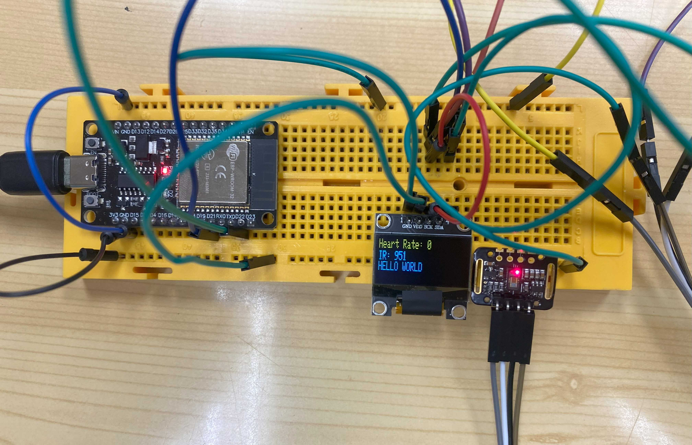

# PRACTICA 5 :  Buses de comunicación I (introducción y I2c)
Alumna: **Africa Abad**
## Ejercicio de subida de nota  ( muy valorado) 

Realizar utilizando el display y el sensor anterior un dispositivo que muestre en display la frecuencia cardiaca  y el contenido de oxigeno .

