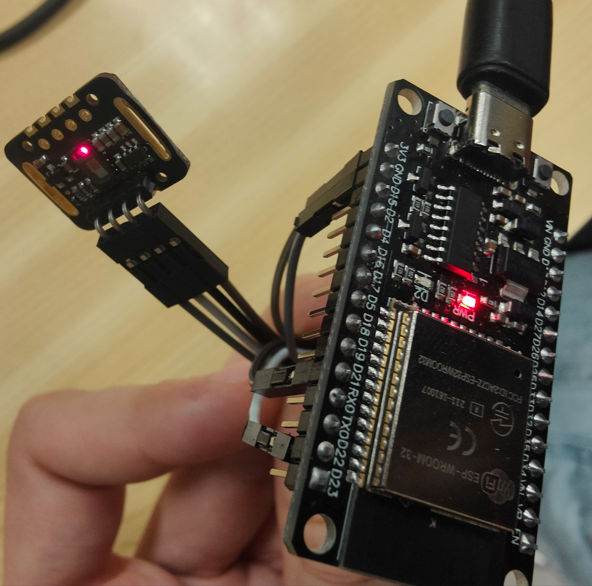
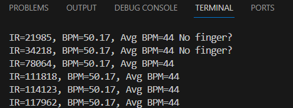

# PRACTICA 5 :  Buses de comunicación I (introducción y I2c)
Alumna: **Africa Abad**

## Ejercicio Practico 2

1. Realizar un programa que utilice un dispositivo i2c. 
 
 1. Foto del montaje 
 

 
 
 Explicación del montaje: 
 | MAX30105 | ESP32 |Color cable|
|----------|-------|-----|
| VIN      | 3V3   | marrón|
| SDA      | D21   | negro|
| SCL      | D22   | blanco|
| GND      | GND   | gris|

 2. salidas de depuracion ( print...) 

  

 3. explicación del codigo 
 
  ### Inicialización y configuración:
Se inicia la comunicación serial a una velocidad de 115200 baudios para la salida de datos.
Se inicializa el sensor MAX30105. Si el sensor no se encuentra, se imprime un mensaje de error y el programa entra en un bucle infinito.
Se configura el sensor con la función setup(), utilizando los ajustes predeterminados.
Se ajusta la amplitud del pulso rojo a un valor de 0x0A y se apaga el LED verde.

  ### Bucle principal (loop()):
Se lee el valor de la luz infrarroja (IR) proveniente del sensor mediante la función particleSensor.getIR().
Se verifica si se detectó un latido cardíaco utilizando la función checkForBeat(). Si se detecta un latido, se calcula la frecuencia cardíaca en pulsaciones por minuto (BPM).
Si la frecuencia cardíaca calculada es válida (entre 20 y 255 BPM), se almacena en un arreglo rates[] para realizar un promedio posteriormente.
Se calcula el promedio de las frecuencias cardíacas almacenadas en el arreglo rates[].
Se imprimen los valores de IR, BPM y BPM promedio a través de la comunicación serial.
Se verifica si hay un dedo colocado en el sensor basándose en el valor de IR. Si el valor de IR es inferior a 50000, se imprime un mensaje indicando que no se detectó un dedo.
 

