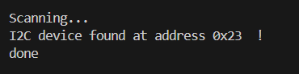
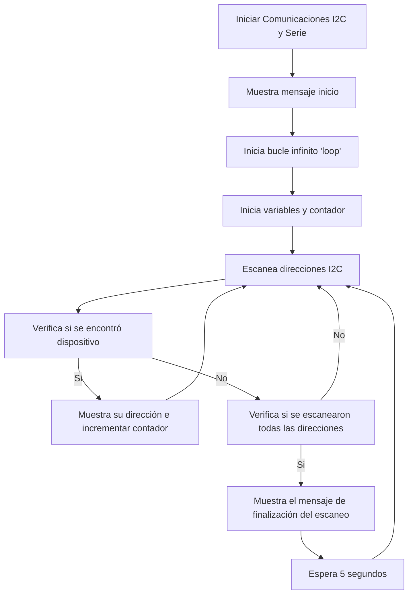

# PRACTICA 5 :  Buses de comunicación I (introducción y I2c)
Alumna: **Africa Abad**

El objetivo de la practica es comprender el funcionamiento de los buses
  sistemas de comunicación entre periféricos;  estos elementos pueden 
  ser internos o externos  al procesador.

Esta es la primera practica donde se verán los buses i2c, spi,
 i2s , usart.


## Ejercicio Practico 1:  ESCÁNER I2C

Programar el siguiente codigo,  colocar varios dispositivos  I2C 


Las resistencias de pull-up  dependen del numero de dispositivos ; 
aunque un valor usual es  3k3 


```
#include <Arduino.h>

#include <Wire.h>


void setup()
{
  Wire.begin();
  Serial.begin(115200);
  while (!Serial);             // Leonardo: wait for serial monitor
  Serial.println("\nI2C Scanner");
}
 
 
void loop()
{
  byte error, address;
  int nDevices;
 
  Serial.println("Scanning...");
 
  nDevices = 0;
  for(address = 1; address < 127; address++ )
  {
    // The i2c_scanner uses the return value of
    // the Write.endTransmisstion to see if
    // a device did acknowledge to the address.
    Wire.beginTransmission(address);
    error = Wire.endTransmission();
 
    if (error == 0)
    {
      Serial.print("I2C device found at address 0x");
      if (address<16)
        Serial.print("0");
      Serial.print(address,HEX);
      Serial.println("  !");
 
      nDevices++;
    }
    else if (error==4)
    {
      Serial.print("Unknown error at address 0x");
      if (address<16)
        Serial.print("0");
      Serial.println(address,HEX);
    }    
  }
  if (nDevices == 0)
    Serial.println("No I2C devices found\n");
  else
    Serial.println("done\n");
 
  delay(5000);           // wait 5 seconds for next scan
}
```

### 1. Descibir la salida por el puerto serie 

El programa empieza imprimiendo por el puerto serie un mensaje que indica que se está realizando un escaneo I2C.

    Scanning...

Mientras dure el escaneo, el programa imprime un mensaje que indica en que dirección específica en caso que se encuentra el dispositivo 'I2C'.

    I2C device found at adress 0xXX!
    Done

Si no se encuentra el dispositivo en la dirección específica, el programa imprime por el puerto serie:

    Unknown error at adress OxXX.
    No I2C devices found


Captura de pantalla hecha por nosotros:


        

### 2. Explicar el funcionamiento 

Escáner I2C para dispositivos conectados a un bus I2C en un microcontrolador.

El programa empieza inicializando la comunicación I2C y el puerto serie.

Una vez que se inicializan las comunicaciones I2C y serie en la función **setup()**, el programa entra en el bucle infinito **loop()**. Dentro de este bucle, se realiza el escaneo continuo de direcciones I2C.

  *1. Escaneo de direcciones I2C*

Se inicializa una variable 'adress' para almacenar las direcciones I2C que se van a escanear (empezando desde 1 hasta 127). 

Con el bucle 'for' se recorren todas las direcciones posibles.

Dentro del bucle, se intenta iniciar una transmisión hacia la dirección actual del dispositivo utilizando **Wire.beginTransmission(address)**.

Con **Wire.endTransmission()** el programa verifica si hay algún error en la transmisión.

  - Si no hay ningún error (error == 0), significa que un dispositivo respondió a la dirección actual y se incrementa el contador **nDevices**.

  - Si se detecta un error (error == 4), se imprime un mensaje indicando que ocurrió un error desconocido en esa dirección.

Para cada dispositivo encontrado, se imprime su dirección en el monitor serial (esto se puede ver en la captura adjuntada en el primer apartado).

  *2. Resultados del escaneo*

Cuando ya se han escaneado todas las direcciones, se verifica si se encontraron dispositivos ('nDevices != 0'). Si no se encontraron dispositivos, se imprime un mensaje indicando que no se concontraron dispositivos I2C.

Por lo contrario, se imprime por el puerto serie un mensaje indicando que se completó el escaneo.

  *3. Espera entre escaneos*

Una vez completado el escaneo de todas las direcciones, el programa espera 5 segundos utilizando 'delay(5000)' antes de empezar con el próximo escaneo. Esto asegura que el escaneo se realice a intervalos regulares.

## 

### Diagrama de flujo


